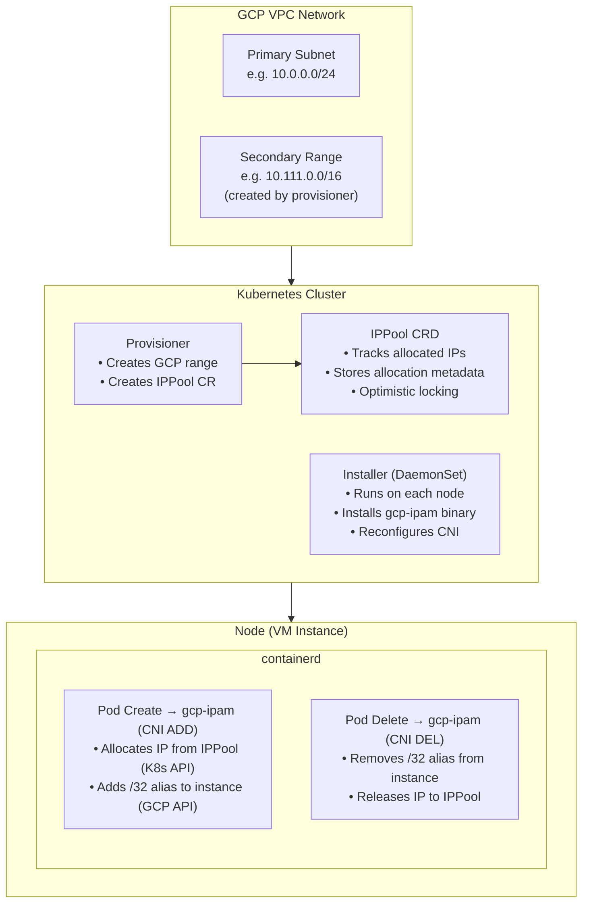
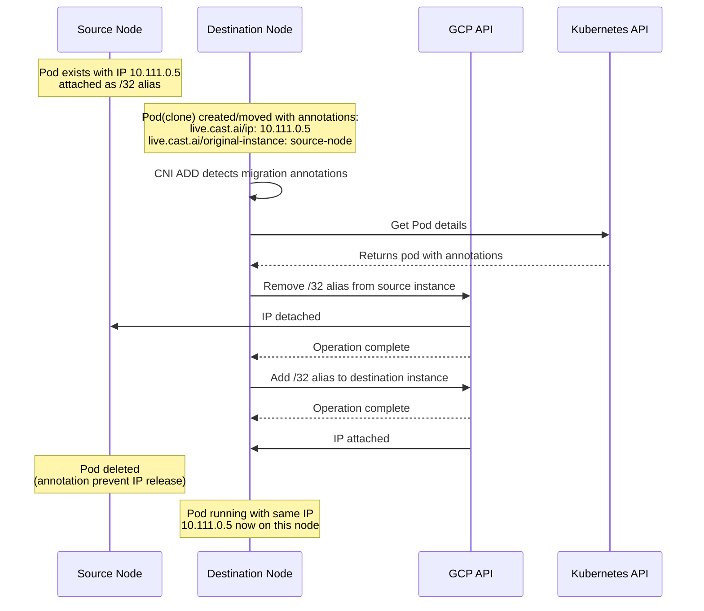

# GCP-CNI Architecture Document

## Table of Contents

1. [Introduction](#1-introduction)
2. [High-Level Architecture](#2-high-level-architecture)
3. [Installation](#3-installation)
4. [Provisioning](#4-provisioning)
5. [CNI Implementation](#5-cni-implementation)

---

## 1. Introduction

GCP-CNI is a specialized Container Network Interface plugin designed for **TCP connection live migration** on Google Cloud Platform. Its primary purpose is to preserve pod IP addresses during VM live migration, ensuring that active TCP connections remain intact when a pod moves between nodes.

### Problem Statement

When pods are migrated between nodes, standard Kubernetes networking assigns a new IP address to the pod on the destination node. This breaks all existing TCP connections, requiring clients to reconnect.

### Solution

GCP-CNI solves this by:

1. **Allocating Internal IP range** - A dedicated CIDR block is provisioned for pod IPs.
2. **Assigning a secondary IP range** in the GCP VPC subnet specifically for pod IPs.
3. **Using GCP Alias IP ranges** - Each pod receives a `/32` alias IP from a secondary subnet range attached to the VM's network interface
4. **Decoupling IP from node** - The IP can be "moved" from one instance to another via GCP API
5. **Coordinated migration** - Special annotations trigger the migration flow where the IP is removed from the source instance and added to the destination before the pod starts

This allows TCP connections to survive pod migrations because the IP address remains the same, and GCP's networking layer routes traffic to the new location.

---

## 2. High-Level Architecture

The system consists of three main components:



### Component Summary

| Component | Type | Purpose |
|-----------|------|---------|
| **Provisioner** | Deployment | One-time setup of GCP secondary IP range and IPPool CRD |
| **Installer** | DaemonSet | Installs CNI binary and configuration on each node |
| **gcp-ipam** | CNI Binary | Allocates IPs to pods and manages GCP alias IPs |
| **IPPool** | CRD | Cluster-wide IP allocation state |

---

## 3. Installation

The Installer runs as a DaemonSet on every node and performs two main functions:

### 3.1 Binary Installation

The installer copies the `gcp-ipam` CNI plugin binary to each node.

**Source:** Container image at `/app/gcp-ipam`
**Destination:** `/home/kubernetes/bin/gcp-ipam` (on host)

Reference: `cmd/installer/main.go:installHostBinary`

### 3.2 CNI Configuration Replacement

The installer modifies the existing CNI configuration to use `gcp-ipam` instead of the default IPAM.

**Configuration file:** `/etc/cni/net.d/10-containerd-net.conflist`

**What changes:**

The IPAM section in the CNI config is replaced:

`"type": "host-local"` -> `"type": "gcp-ipam"`

Reference: `cmd/installer/main.go:reconfigureCNIIPAMConf`

### 3.3 Limitations

- no way to detect which pod should have live IP range so IPAM plugin is configured cluster-wide
- no way to detect updates of top level CNI, (ptp vor DPv1 or Cilium for DPv2) so if CNI is updated the installer needs to be re-run to patch the config again

---

## 4. Provisioning

The Provisioner creates the network infrastructure required for pod IP allocation.

### 4.1 When Provisioning is Needed

Provisioning is only required for the secondary IP ranges allocation method. When Static IP is used, the primary subnet is pre-defined in allocation method and does not need provisioning.

### 4.2 Provisioning Flow

1. Discover Cluster Info
2. Reserve Internal IP Range
3. Creates reservation in 10.0.0.0/8(Default size: /16 )
4. Create Secondary Range on Subnet. Patches subnet to add secondary range. Links to internal reservation.
5. Create/Update IPPool CRD. The CRD tracks allocated IPs and metadata.

**References:**
- `internal/provisioner/cluster.go`
- `internal/provisioner/range.go`
- `internal/provisioner/provisioner.go`

### 4.3 IPPool Resource

The provisioner creates an IPPool custom resource that stores:

```yaml
apiVersion: ipam.gcp-cni.cast.ai/v1alpha1
kind: IPPool
metadata:
  name: ippool-{subnet-name}
spec:
  cidr: "10.111.0.0/16"
  subnet: "projects/{project}/regions/{region}/subnetworks/{name}"
  secondaryRangeName: "live"
  allocations: {}   # Filled by IPAM plugin as pods are created
status:
  capacity: 65534   # Total usable IPs (excluding network/broadcast)
  allocated: 0
  available: 65534
```

As with the internal reservation and secondary range IP provisioning, there is no way to track and allocate IP
inside the GCP, some other system is needed to track allocated IPs. The IPPool CRD serves this purpose.

Reference: `pkg/apis/ipam/v1alpha1/types.go:1-84`

---

## 5. CNI Implementation

The `gcp-ipam` binary is the CNI plugin that handles pod IP allocation and migration.

### 5.1 Standard IP Assignment Flow (CNI ADD)

When a pod is created, containerd calls the CNI plugin(depending on wheter dataplane V1 ptp or V2 Cilium) that then delegates IP allocation to IPAM plugin that in our case 
runs following logic: 


1. Acquire Lock. File lock: /var/run/gcp-ipam.lock. Prevents concurrent allocation conflicts as assigning alias IP to the instnace needs to be atomic. 
2. Get Pod Information from k8s API.
3. Allocate IP from IPPool(Kubernetes API). Find available IP in CIDR range. Record allocation with pod metadata. Uses optimistic locking
4. Add Alias IP to Instance(GCP API). Compute API: instances.updateNetworkInterface. Adds /32 alias IP to secondary range. Waits for operation completion.
5. Return CNI Result. IP address from allocation. Gateway (subnet base + 1). Default route (0.0.0.0/0)

**References:**
- Step 2: `cmd/ipam/main.go`
- Step 3: `pkg/ipam/allocator.go`

### 5.2 Migration Flow

The migration flow differs from standard assignment by using **pod annotations** to coordinate IP movement between nodes.

**Annotations used:**

| Annotation | Purpose |
|------------|---------|
| `live.cast.ai/ip` | Specifies the IP address to use (on destination pod) |
| `live.cast.ai/original-instance` | Source node where IP is currently attached |
| `live.cast.ai/move-out-ip` | Marker that IP is being migrated out (on source pod) |

**Migration Sequence:**



### 5.3 IP Release Flow (CNI DEL)

When a pod is deleted:

1. Check for Migration Marker. If live.cast.ai/move-out-ip exists skip release (IP moving to new node), otherwise: proceed with release.
2. Remove Alias IP from Instance(GCP API). Filter out pod's /32 from alias IP list. Update network interface.
3. Release IP to Pool(Kubernetes API). Remove allocation from IPPool. Update pool status.


### 5.4 Key Differences: Standard vs Migration Flow

| Aspect | Standard Flow | Migration Flow |
|--------|---------------|----------------|
| **IP Selection** | Next available from pool | Specified via `live.cast.ai/ip` annotation |
| **Source Cleanup** | N/A (new pod) | Remove IP from original instance before adding to new |
| **Pool Allocation** | New allocation created | Existing allocation reused/transferred |
| **On Delete** | IP released to pool | IP retained (if `move-out-ip` annotation present) |

### 5.7 Performance Considerations

Multiple pods may be created simultaneously across nodes. Few steps are need to be atomic:

- IP allocation from IPPool - uses k8s optimistic locking to avoid conflicts via `resourceVersion`, during testing this was not a bottleneck unless there are very high number of concurrent pod creations(not sure still for the numbers that will bottleneck this), this could be optimized by using different IP allocation method (like StaticIP) 
- GCP API calls to add/remove alias IPs - serialized via file lock per instance - this right away limits performance to 1 pod creation/deletion/migraiton at a time per node, this call takes up to 3 seconds to complete during testing, so this is the main bottleneck in the system, especially during migration as two calls are needed per pod migration(however this could be parallelized if needed), this also could be optimized by using different IP assignment method (like Forwarding Rules)
